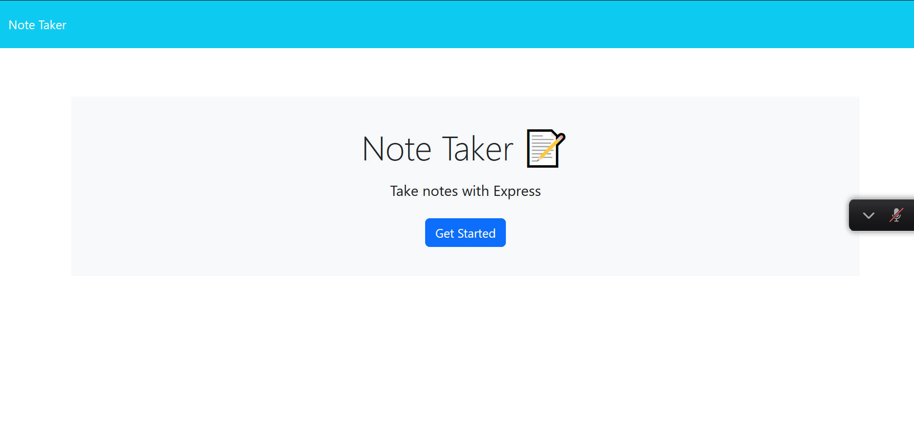

# Note Taker

## Table of Contents:

- [Description](#description)
- [User Story](#UserStory)
- [Usage](#usage)

## Description:
Note Taker Application that allows user to type notes and save it.
If Heroku deployment isn't working correct. User can download repo > do npm start > and run localhost:3002

[Note Taker](https://notetaker32-a9ae61cc900a.herokuapp.com/)

## User Story:

AS A small business owner
I WANT to be able to write and save notes
SO THAT I can organize my thoughts and keep track of tasks I need to complete

## Technologies Used: 

express
